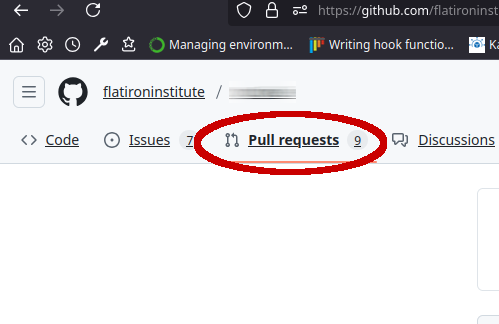
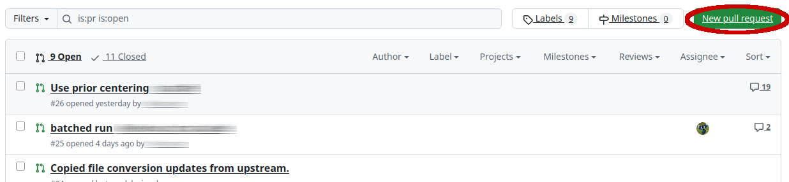
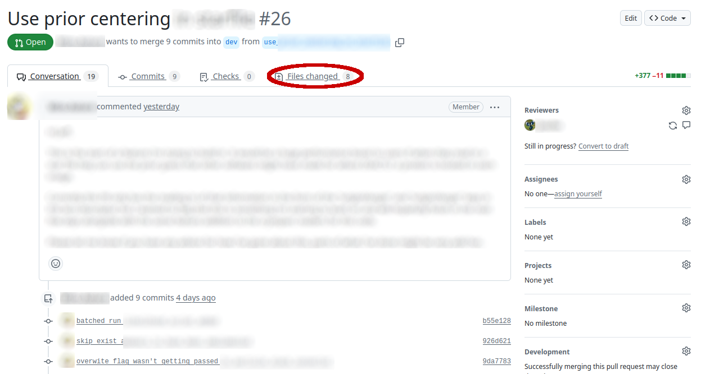
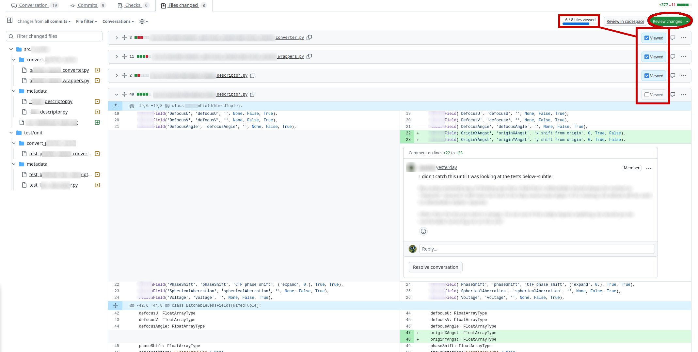

# Code Review

## What Is Code Review?

**Code Review** is a collaborative process of reading and editing software
code changes, often done as part of a
[pull request](https://docs.github.com/en/pull-requests/collaborating-with-pull-requests/proposing-changes-to-your-work-with-pull-requests/about-pull-requests)
before accepting the proposed changes into the primary (`main`) branch.
Think of it as "peer review for code changes."

Code review offers several benefits for collaborative software projects:

* The *contributor* gets valuable feedback about the changes & how to improve them
* The *reviewer(s)* can more easily stay up to date with the state of the codebase & project
* The *codebase* is more standardized in terms of style and approach
* *All participants* can have greater confidence in the changes' correctness

Along with a well-thought-out test suite, regular & thorough code review is one of the best
ways to catch software defects before public release, with some studies showing that review
cuts errors by over 80%.

## Getting Started with Code Review

Apart from informal spot checks or discussion, most teams do code review as part of
a formal workflow for making changes.

One workflow that makes it easier to get the benefits of code review looks like this:

* *Desired future changes* (like bug reports, areas for improvement, or new feature requests)
are tracked as part of an overall to-do list of future work on the project, known as a
*backlog*. Github has [integrated issue tracking tools](https://docs.github.com/en/issues/tracking-your-work-with-issues/about-issues)
that can help you get a complete picture of desired changes, organize them by priority,
keep records of the design decisions for how to implement them, and note who will be working
on the implementation.
  * Discussing the issue before starting implementation saves a lot of effort and ensures that the
  broad outline of the solution is agreed upon.
* When someone wants to work on an issue, they do so in a [branch](https://docs.github.com/en/pull-requests/collaborating-with-pull-requests/proposing-changes-to-your-work-with-pull-requests/about-branches).
Using separate branches for features makes sure that the main project stays in a functional state and that
changes from different issues don't interfere with each other. It also helps to resolve conflicts when
multiple changes need to be applied to the main version at overlapping times.
  * To minimize conflicts, branches should avoid being too long-lived: try to separate features into
  several gradual steps rather than one big ambitious push.
* The change developer can push proposeed changes to their branch during development. This provides a backup,
and also makes it easier to discuss with collaborators, since everyone can see the work in progress.
* When the change developer believes their changes are complete, they open a pull request and ask their
colleagues to review the changes.
* Colleagues review the changes using Github tools, and have the opportunity to ask questions and make
suggestions for further improvement. This can include dicussions of specific lines of code.
* When enough reviewers agree that the changes solve the issue in an agreed-upon way, a reviewer will
accept the changes into the main branch and they will become official. This can be done by either
a `git merge` on command line, or through the Github interface.

### Dealing with branch conflicts

During the course of development, different branches may introduce changes that conflict
with each other. Using shorter-lived branches and breaking your project into multiple files
can reduce this issue, but won't eliminate it.

The two main ways to surface these conflicts are:

1. After the pull request is approved, merge the current `main` branch into the feature branch.
2. Use `git rebase` to replay the changes from the feature branch, as though they had been made
to the current `main` instead of whenever it actually started.

Both approaches can be suitable, but most projects will pick one or the other and stick with it.
See [this Atlassian merging-vs-rebasing article](https://www.atlassian.com/git/tutorials/merging-vs-rebasing)
for discussion about the pros and cons of each.

Either way, the specific lines of conflicting code will need to be resolved manually; however,
once that is done, merging the feature branch into the main branch should be painless.

### What makes a good branch?

Most teams find it easier to handle changes by making lots of smaller changes rather than the
all-at-once approach. Making changes continuously makes it easier to understand the current
state and trajectory of the project, as well as simplifying both conflict resolution and code review.

Consider the following suggestions:

* Break large feature requests into smaller issues that can be resolved discretely.
  * It's okay if the new version of a function lives alongside the old version for a little while.
  * It can be helpful to separate non-user-visible refactoring from changes that users will actually
  see. For instance, if your software will switch to a new algorithm for some task, consider implementing
  the functions for this algorithm before making the switch to your users, to get extra testing time.
* Minimize the number of incidental changes on any particular branch.
  * If the point of a feature branch is to add support for a new file type, do not include unrelated
  changes that make some computation more efficient.
  * Having lots of changes as part of the same PR makes it hard for reviewers to understand the
  implications, or even know what the important changes are for review.
  * In particular, sweeping changes to formatting or file layouts will mean that almost every
  line of code has changed, which would make substantitve changes nearly impossible to review.
  These kinds of change should always be in their own branch.
* When writing notes for your pull request, it is helpful to give reviewers an idea of the important
changes to review--what files to look at, and in what order.
* If you find that lots of change requests always touch the same few files, consider whether those
files themselves are handling too much functionality.

### What makes a good code review?

A pull request, and the code review that surrounds it, can be an emotionally charged moment for
many people. We're all a bit shy about sharing our work, especially if software development is
not our primary activity, and most people who write papers have some unpleasant experiences with
reviewers.

Good code review should be a positive learning experience, both for the contributor and the reviewers.
Here are some things to keep in mind that can help:

* **Constructive comments**: Code review is an opportunity to learn, and the goal is to improve the
quality of every contribution. This is most likely to be successful when comments are specific and
actionable, and driven by the goal of improving the work itself.
  * As a *contributor*, remember that suggestions for changes are about specific work, not a general
  reflection on you as a scientist, software developer, or person.
  * As a *reviewer*, live up to that standard: make sure that suggestions are about improving specific
  issues, be considerate in your tone, and avoid requesting changes that are motivated by insecurity,
  rivalries, or the need to add your personal touch.
* **Be flexible**: Different collaborators, being different people, have different perspectives and
approaches to problems. Be open to unexpected solutions.
  * As a *contributor*, accept requests for changes with grace and try to understand where your
  reviewer is coming from. If something is confusing for your reviewers or doesn't fit with the
  overall style of the code base, be open to changing it. If you don't understand feedback, ask
  for, and seriously consider, the explanation. (But of course be willing to advocate
  for your version if there are concrete reasons for it.)
  * As a *reviewer*, expect to see solutions that you didn't expect. Just because something isn't
  written the exact way you would've written it, doesn't make it wrong. Favor asking questions about
  implementation details you don't understand or agree with, rather than declaring them wrong. (But of
  course be ready to request changes to ensure that contributed code matches the coding style of the
  existing project.)
* **Have clear expectations**: Code contributions work best when they follow a clearly envisioned and
explicitly documented overall project architecture. Having a code style standard--which could cover
everything from line lengths and function-calling styles to spacing, variable names, and documentation
expectations--will make your code easier to read. Most importantly, it's best to come to a clear
understanding of a solution approach using Issues, before development begins: this will reduce the
chances that sweeping changes need to be requested at the code review stage, once lots of work has
been done at a significant investment of time.
  * As a *contributor*, make sure that you've clearly understood the problem and have an agreement
  about your solution approach before you begin coding. If you're making an unsolicited contribution,
  be aware this may result in a more protracted review process. Also, make sure you've clearly indicated
  (both in the code, as needed, and in your pull request notes) what you've changed and why.
  * As a *reviewer*, understand that your requests for changes will have less sting if you can point
  to particular standards. Expecting someone to remove all the semicolons could seem petty, but if you
  have a style guide you can point to, the request becomes obvious. Similarly, try to give a reason for
  any major change request.

## Github Code Review Features

Github offers a dedicated workspace with many features to facilitate effective code review conversations.

Open pull requests to a project will be visible from the "Pull Requests" area of the Github project page:

This will bring you to a page that shows formal change requests from the project. By default, the view
is filtered to requests that are currently open, but you can use other filters to review prior conversations.
You can also create a new pull request by clicking the green button in the upper right.

Note that each pull request receives a number, and the rightmost column will indicate the number of comments
on the request.

Clicking on any open PR brings up its conversation page. This page provides a summary of several
important bits of information. The contributor gave the PR a short but descriptive name, which is
shown at the top, next to the PR number. (Github assigns every pull request and issue a unique
number--the same pool is used for both, to avoid confusion between issue 15 vs pull request 15.)

Below this headline, you can see that the PR is listed as open (green oval badge on the left).
This line also gives the user name of the contributor (which we've blurred for privacy reasons)
and a summary of the number of commits, the destination branch (here `dev`) and the name of
the originating feature branch.

The conversation begins with a comment from the contributor. While it's been blurred for
privacy, this is a good example of a note that indicates what the contributor is looking for
from reviewers (in this case, advice on a work-in-progress), what changes are most significant
to review, and the overall impact of the proposed change. For larger sets of changes, many
developers will write [more detailed summary notes](https://github.com/flatironinstitute/stan-playground/pull/80)
when requesting review.

Below the summary is a list of the commits that went into this PR. This contributor has given
each commit a useful descriptive name, which helps reviewers understand the thread of the changes.
Clicking on any of the commits will bring up a separate view showing the changes from that particular
commit.

At the bottom of the conversation page (not shown) there are buttons to merge the pull request, or
close it unmerged. If there are conflicts, Github provides tools to resolve them via the web, or
by pushing additional commits to the PR branch.

Clicking the "files changed" tab (circled in red) brings the reviewer to perhaps the most
useful page of the reviewing tools:

* From this page (green button circled in the upper right), the reviewer can issue an overall
review: comment, "Approve", or "Request changes."
  * Comments are for overall discussion.
  * Approval is a sign that the code is ready to be merged
  * "Request changes" indicates that further specific changes are needed before the code
  is ready to be merged, and will block merging until it is resolved.

* The left-hand panel shows a tree view of the files changed in this pull request.
  * The badges indicate whether the file was new, deleted, or changed.
  * Files can be filtered to limit what the reviewer has to look at.

* The main pane shows the complete collection of changed files. Each one has
a header. The header provides:
  * The file's name and path
  * A caret (left-hand side) that temporarily collapses the file
  * Badges showing the overall quantity of additions (green boxes) and deletions (red boxes)
  * A checkbox on the right to mark the file as "viewed." This persistently
  collapses the file and increments the progress bar at the top.
  * Marking files as reviewed helps with large pull requests that may be reviewed over an
  extended time.
  * Additionally, files marked as viewed will remain collapsed between sessions, unless a
  subsequent commit to the PR branch makes changes to them.

* Each file provides a `diff` of the PR-specific changes.
  * The left-hand pane shows the existing version on the target branch (e.g. `main`)
  * The right-hand pane shows the proposed changed version from the feature branch.
  * Proposed changes are highlighted in green in the new version, while changed material
  from the older version is highlighted in red.
    * If you prefer a unified diff version, this is available from the gear dropdown.
  * Only a few lines of context are shown by default, but the arrows in the left-hand
  side of the blue bar will expand the visible context window.
  * The reviewer can start a conversation about a specific line of changed code by clicking
  the + sign next to the line number. (Multiple lines can be commented by clicking and
  dragging in this area.) The contributor and other reviewers can respond to the conversation,
  facilitating highly specific discussion of changes & potential revisions.
  * When the parties have reached a consensus, conversations can be marked "resolved" and will
  be collapsed.
  * Conversations from this page will also appear on the "Conversation" tab.

